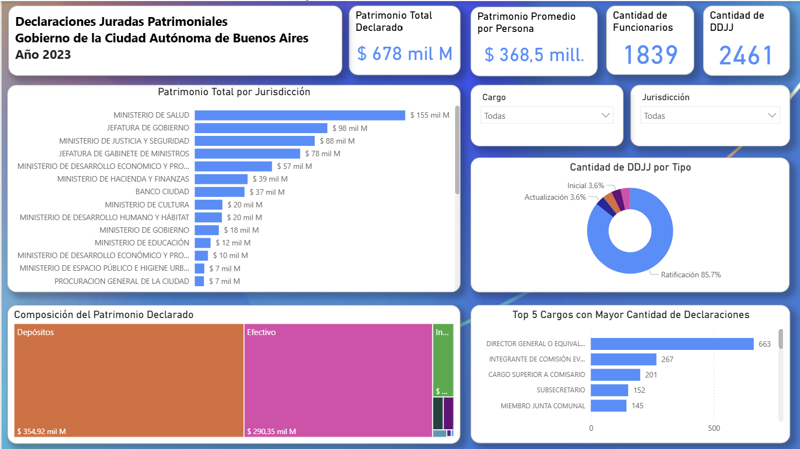

# 📊 Declaraciones Juradas Patrimoniales — GCBA 2023

Dashboard interactivo en Power BI que analiza las declaraciones juradas patrimoniales presentadas por los funcionarios públicos del Gobierno de la Ciudad Autónoma de Buenos Aires (GCBA) correspondientes al año 2023.



---

## 📌 Descripción

Este proyecto explora los datos patrimoniales declarados por **1.839 funcionarios** del GCBA, pertenecientes a las jurisdicciones con rango ministerial, a partir de **2.461 declaraciones juradas** presentadas durante 2023. El análisis busca favorecer la transparencia y el acceso a la información pública, permitiendo identificar patrones en la composición y distribución del patrimonio declarado.

El patrimonio total declarado asciende a **$678 mil millones**, con un promedio de **$368,5 millones por persona**.

---

## 🗂️ Estructura del repositorio

```
📁 Analisis_DDJJ_Patrimoniales_GCBA_2023/
│
├── Analisis_DDJJ_Patrimoniales_GCBA_2023.pbix   # Archivo Power BI
├── data/
│   └── ddjj_2023.csv                             # Dataset original (fuente: BA Data)
├── screenshots/
│   └── dashboard.png                             # Captura del dashboard
└── README.md
```

---

## 📈 Visualizaciones del dashboard

### KPIs principales
Tarjetas con los indicadores globales: patrimonio total declarado, patrimonio promedio por persona, cantidad de funcionarios y cantidad de DDJJ.

### Patrimonio Total por Jurisdicción
Gráfico de barras horizontales con el patrimonio agregado por ministerio u organismo. Las jurisdicciones con mayor patrimonio declarado son:

| Jurisdicción | Patrimonio |
|---|---|
| Ministerio de Salud | $155 mil M |
| Jefatura de Gobierno | $98 mil M |
| Ministerio de Justicia y Seguridad | $88 mil M |
| Jefatura de Gabinete de Ministros | $78 mil M |
| Min. de Desarrollo Económico y Producción | $57 mil M |

### Cantidad de DDJJ por Tipo
Gráfico de dona con la distribución por tipo de declaración:
- **Ratificación** — 85,7%
- **Actualización** — 3,6%
- **Inicial** — 3,6%

### Composición del Patrimonio Declarado
Mapa de árbol (*treemap*) que desglosa los activos declarados por categoría. Los rubros de mayor peso son **Depósitos** ($354,92 mil M) y **Efectivo** ($290,35 mil M).

### Top 5 Cargos con Mayor Cantidad de Declaraciones
Ranking de los cargos con más DDJJ presentadas:

| Cargo | Declaraciones |
|---|---|
| Director General o equivalente | 663 |
| Integrante de Comisión Evaluadora | 267 |
| Cargo Superior a Comisario | 201 |
| Subsecretario | 152 |
| Miembro Junta Comunal | 145 |

### Filtros interactivos
El dashboard permite filtrar todas las visualizaciones por **Cargo** y **Jurisdicción**.

---

## 🗃️ Fuente de datos

| Campo | Detalle |
|---|---|
| **Dataset** | Declaraciones Juradas Patrimoniales |
| **Organismo publicador** | Oficina de Integridad Pública — GCBA |
| **Portal** | [Buenos Aires Data](https://data.buenosaires.gob.ar/dataset/declaraciones-juradas) |
| **Año analizado** | 2023 |
| **Formato original** | CSV / XLSX |
| **Licencia** | [CC-BY-2.5-AR](https://creativecommons.org/licenses/by/2.5/ar/) |

> Los datos son de acceso público y se actualizan mensualmente en el portal oficial.

---

## 🛠️ Herramientas utilizadas

- **Power BI Desktop** — Modelado de datos, DAX y visualización
- **Power Query** — Transformación y limpieza del dataset

---

## 🚀 Cómo usar este proyecto

1. Clonar o descargar el repositorio.
2. Abrir `Analisis_DDJJ_Patrimoniales_GCBA_2023.pbix` con **Power BI Desktop** (descarga gratuita en [powerbi.microsoft.com](https://powerbi.microsoft.com/)).
3. Si querés actualizar los datos, reemplazá el archivo en `data/` con una versión más reciente del portal BA Data y refrescá la fuente desde Power Query.

> **Nota:** El archivo `.pbix` ya incluye los datos embebidos, por lo que puede abrirse directamente sin configurar ninguna conexión externa.

---

## 👤 Autor

**Ignacio Lopez Parra** — Analista de Datos
Proyecto personal de análisis de datos abiertos del sector público.

---
